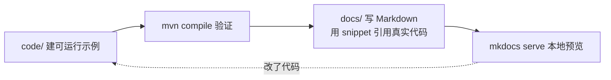

# 写给谁、怎么读

## 这份教程的「一句话」

把一个**只会写 Vue** 的前端工程师，变成一个**能独立写出 Spring Boot 后端**、并完成全栈打通的人。
中间用你最熟悉的 JS/TS/Vue 概念做桥梁，而不是让你硬啃一本"Java 程序员养成手册"。

## 设计原则

1. **类比优先**：每个新概念，先告诉你"这在 Vue/JS 里相当于什么"，再讲 Java 的细节。
2. **够用即可**：语言篇只讲到"能写后端"所需——不碰 JUC 源码、JVM 调优、23 种设计模式。
3. **代码可信**：所有示例都是仓库里真实可编译的 `.java`，文档直接引用嵌入，所见即所编译。

## 仓库结构

```
java-glm/
├── mkdocs.yml              # 本教程的 mkdocs 配置
├── docs/                   # 你正在看的教程（Markdown 章节，按 5 篇分目录）
│   ├── index.md
│   ├── 01-prep/            # 第一篇 · 准备与地图
│   ├── 02-language/        # 第二篇 · Java 语言基础
│   ├── 03-spring/          # 第三篇 · Spring Boot 后端
│   ├── 04-fullstack/       # 第四篇 · 全栈实战
│   └── 05-advanced/        # 第五篇 · 进阶与新特性
└── code/                   # 全部可运行代码（Maven 聚合工程）
    ├── pom.xml             # 聚合 parent：一条命令编译全部
    ├── language/           # 语言篇示例（每章一个 module）
    └── task-manager/       # 终局项目：Spring Boot 工程
```

## 日常工作流（写一章 = 四步）



1. 在 `code/` 对应模块里写 `.java` 示例；
2. `mvn -f code/pom.xml compile` 确认能编译通过；
3. 在 `docs/` 写 Markdown，用 `--8<-- "..."` 引用刚才那个真实 `.java`；
4. `mkdocs serve` 本地预览，边写边看。

代码一改，文档展示自动同步——**永远不会出现"页面上的代码和能跑的代码不一致"**。

## 阅读约定

- :simple-vuedotjs: **Vue 视角** 蓝色提示框：帮你建立 JS→Java 映射。
- !!! warning 红色提示框：前端人最容易踩的坑。
- !!! tip 绿色提示框：实战经验、加速建议。
- 代码块右上角有「复制」按钮，可直接拿去跑。

---

下一篇：[开发环境搭建](02-env-setup.md)
