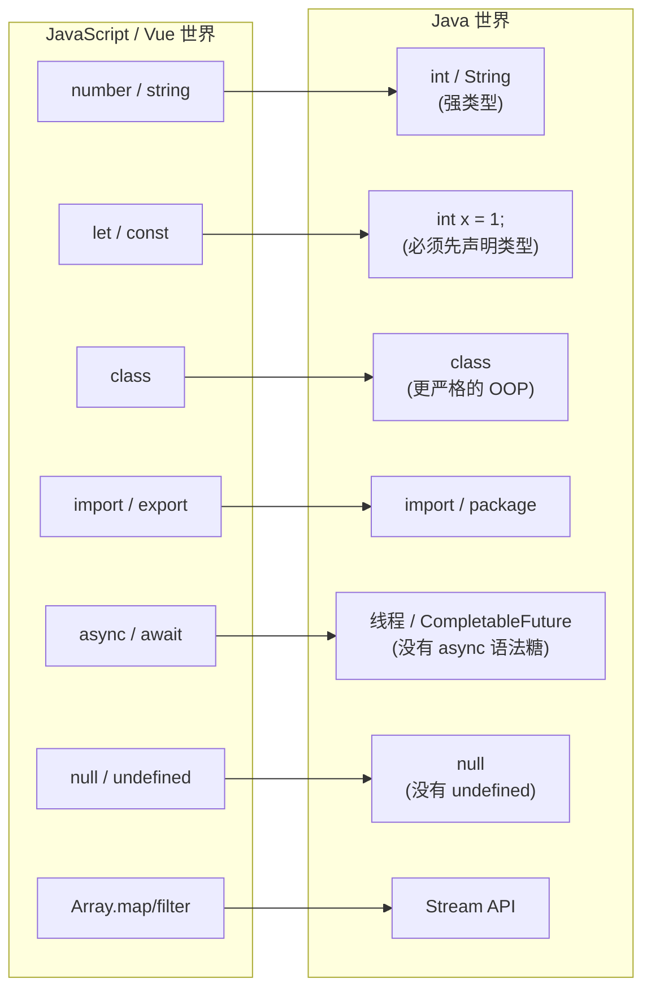

# Vue/JS 工程师的 Java 速查表

> 这是全书的**类比桥梁**。把你在 JS/TS/Vue 里早已烂熟的概念，一一映射到 Java。
> 读到后面任何陌生概念，都可以回到这里查"它在 JS 里叫什么"。

## 一图建立直觉



## 对照速查

| 主题 | JS / TS | Java | 关键差异 |
|---|---|---|---|
| **类型** | 动态，运行时才知类型 | 静态，**编译期**就定死 | Java 变量必须先写类型：`int x = 1;` |
| **相等** | `==`（会隐式转换）/ `===` | `==`（引用）/ **`equals()`**（内容） | 比字符串内容**必须用 `.equals()`**，`==` 会坑死你 |
| **字符串** | `"a" + "b"` | `"a" + "b"`、模板串要用 `String.format` | 没有反引号模板字符串（JDK 8 没有） |
| **变量声明** | `let` / `const` | `类型 名 = 值;` | 类型写在前面：`String name = "Tom";` |
| **空值** | `null` / `undefined` 两种 | 只有 `null`（外加 `Optional`） | 没有 undefined |
| **数组** | `Array` 可变长 | `int[]` 定长 | Java 数组长度固定，要变长用 `List` |
| **集合** | `Array` / `Set` / `Map` | `List` / `Set` / `Map`（接口 + 多种实现） | `List<String>` 泛型写法 ≈ TS 的 `string[]` |
| **类** | ES6 `class` | `class`（更严格：单继承、字段需声明类型） | 一个文件只能有一个 `public class` |
| **模块** | ES Module `import/export` | `package` + `import` | `package` 是目录结构，必须和目录对应 |
| **异步** | `async/await`、Promise | 线程、`CompletableFuture` | **没有 async 语法糖**，靠线程 |
| **错误处理** | `try/catch/throw` | `try/catch/throw` + **受检异常** | 有的异常编译器强制你 catch（JS 没有） |
| **函数** | `const f = (x) => ...` | 方法必须挂在类上；`Lambda: (x) -> ...` | Java 没有顶层函数，一切在类里 |
| **this** | 谁调用指向谁（箭头函数另说） | 指向当前对象实例 | 行为更稳定，不会"飘" |

## 三个最容易踩的坑

!!! danger "坑一：字符串比较用 == "
    ```java
    String a = new String("hi");
    String b = new String("hi");
    a == b;        // false ！比的是引用地址
    a.equals(b);   // true  ✓ 比内容
    ```
    **铁律：Java 里比较字符串（和任何对象）内容，一律用 `.equals()`。**

!!! danger "坑二：变量必须先声明类型"
    ```js
    // JS
    let x = 1;       // ✓ 不用写类型
    ```
    ```java
    // Java
    int x = 1;       // ✓ 必须写类型
    x = "hello";     // ✗ 编译报错！x 已经是 int，不能塞字符串
    ```
    Java 的类型在**编译期**就锁死，这是它和 JS 最大的体感差异，也是它的"啰嗦"与"安全"之源。

!!! danger "坑三：没有顶层函数，一切在 class 里"
    ```js
    // JS：随手定义一个函数
    function add(a, b) { return a + b; }
    ```
    ```java
    // Java：必须放进一个 class
    public class MathUtil {
        public static int add(int a, int b) { return a + b; }
    }
    // 调用：MathUtil.add(1, 2)
    ```

## 心态校准

| 你可能会想 | 实际情况 |
|---|---|
| "Java 好啰嗦，什么都得写类型" | 啰嗦换来的是**编译期帮你抓 bug**——很多 JS 的运行时错误，Java 编译时就挡住了 |
| "为什么一个文件只能一个 public class" | 这是 Java 的工程纪律，配合 `package` 管理大型项目反而更清晰 |
| "没有 async/await 怎么写异步" | 有！线程 + `CompletableFuture`，第三篇 Spring 里你会大量用到 |

---

带着这张速查表，进入 [第二篇 · Java 语言基础](../02-language/04-types-variables.md)。
