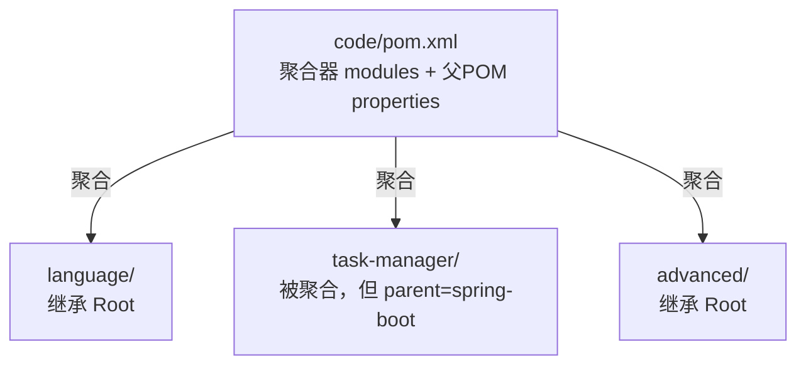

# Maven 必备

第 02 章你装好了 Maven，知道它是"Java 的 npm"。但 npm 用熟了不代表 Maven 就懂——它有些 **npm 里根本没有的概念**（生命周期、依赖范围、多模块聚合），恰恰是前端人最容易卡住的地方。这一章把它们讲透。

## GAV 坐标：依赖的"身份证"

每个 Maven 依赖/项目靠三个字段唯一定位，叫 **GAV**：

| 字段 | 含义 | npm 对照 |
|---|---|---|
| `groupId` | 组织/公司 | 包的 scope/作者 |
| `artifactId` | 模块名 | 包名 |
| `version` | 版本 | 版本号 |

```xml
<groupId>com.javaglm</groupId>
<artifactId>task-manager</artifactId>
<version>1.0.0-SNAPSHOT</version>
```

`SNAPSHOT` 表示"开发中快照版"，Maven 会每次检查更新；正式版不带它。

## pom.xml：本书工程的真实结构

本书所有代码在 `code/` 下，用 Maven 多模块组织。根 pom（既是**聚合器**又是**父 POM**）：

```xml
--8<-- "pom.xml"
```

这段真实文件演示了几个关键点：

- `<packaging>pom</packaging>`：它本身不产 jar，只是个"管理其他模块"的壳。
- `<modules>`：聚合——声明要一起构建的子模块（language / task-manager / advanced）。
- `<properties>`：集中配置（编译版本、编码），子模块继承。
- `<build><pluginManagement>`：钉死插件版本——这是踩过坑的教训：不钉版本会回退到旧插件（比如 3.1 的 compiler 不支持 `release`，编译直接报错）。

## ★ 生命周期（lifecycle）与阶段（phase）

这是 Maven 和 npm **最大区别**。Maven 有一套**有序的阶段**，每个阶段绑定具体动作：

```
clean → validate → compile → test → package → verify → install → deploy
```

| 命令 | 跑到哪个阶段 | 干什么 |
|---|---|---|
| `mvn compile` | compile | 编译 `src/main` |
| `mvn test` | test | 编译 + 跑测试 |
| `mvn package` | package | + 打成 jar/war |
| `mvn install` | install | + 装进本地仓库 |
| `mvn clean` | — | 删 `target/`（清理） |

**关键认知**：阶段是**有序**的，跑后面的会**自动先跑前面的**。所以 `mvn package` 会自动先 compile + test。这就是为什么你 `package` 时会看到测试在跑。

```bash
mvn clean package             # 清理 + 编译 + 测试 + 打包（最常用）
mvn clean package -DskipTests # 跳过测试打包（赶时间用）
```

## ★ 依赖范围（scope）

npm 没有、但 Maven 很重要的概念：一个依赖在**什么时候可用**。看 task-manager 的真实依赖：

```xml
--8<-- "task-manager/pom.xml"
```

注意各依赖的 `<scope>`：

| scope | 何时可用 | 例子（task-manager 里） |
|---|---|---|
| compile（默认） | 编译 + 运行 + 打包 | spring-boot-starter-web |
| **test** | 只在测试时 | spring-boot-starter-test |
| **runtime** | 运行时（编译不需要） | mysql-connector-java、jjwt-impl |
| **provided** | 编译需要，运行时由容器提供 | servlet-api（打 war 部署到 Tomcat 时） |

**为什么 mysql 标 runtime**：你的代码不直接 `import` MySQL 驱动的类（是 JDBC/MyBatis 在运行时通过反射加载的），所以编译期不需要它。标 `runtime` 让它不污染编译，但最终包里仍会带上。

## 传递依赖与冲突

加 A，A 依赖 B，B 自动也来了——这叫**传递依赖**。好处是少写依赖，坏处是可能版本冲突。

```bash
mvn dependency:tree     # 看完整依赖树：谁引了谁、版本多少
```

冲突时 Maven 用**最短路径优先**（离你近的版本赢）。遇到诡异的 `NoSuchMethodError`，多半是版本冲突，`dependency:tree` 排查。

## ★ 多模块：聚合 vs 继承

这两个概念前端人最容易混。本书仓库就是活教材：

- **聚合（aggregation）**：根 pom 的 `<modules>`，让一条命令（`mvn -f code/pom.xml compile`）构建所有子模块。聚合只管"一起构建"。
- **继承（inheritance）**：子模块的 `<parent>` 指向父 pom，继承它的 properties、插件配置。

**关键**：两者**独立**。一个模块可以"被聚合"但"不继承"。本书 task-manager 就是：它被 `code/pom.xml` 聚合（在 `<modules>` 里），但它的 `<parent>` 用的是 `spring-boot-starter-parent`（外部），**不继承** code/pom.xml。这样它能享受 Spring Boot 的依赖版本管理。



## 本地仓库 ~/.m2 与 settings.xml

- 下载的依赖全存在 `~/.m2/repository`（对标 `node_modules`，但是**全局共享**，不在每个项目里重复下）。
- `~/.m2/settings.xml` 配镜像（第 02 章配过阿里云）、私服地址、账号。
- 公司内部依赖通常放**私有 Nexus 仓库**，在 settings.xml 配 `<repository>` 或 mirror。

## IDEA 里的 Maven

- 打开 pom.xml，IDEA 右上角 **Maven 刷新按钮**（reload）：改了 pom.xml 后点它，重新下载/同步依赖。
- 右侧 Maven 面板：双击 lifecycle 的 phase（clean / compile / test / package）直接跑。
- 依赖图（`Show Dependencies`）：可视化依赖树，找冲突。

## 命令速查

| 想干什么 | 命令 |
|---|---|
| 编译 | `mvn compile` |
| 跑测试 | `mvn test` |
| 打包 | `mvn clean package` |
| 打包跳过测试 | `mvn clean package -DskipTests` |
| 只构建某个模块 | `mvn -pl task-manager -am compile` |
| 看依赖树 | `mvn dependency:tree` |
| 清理 | `mvn clean` |

---

至此 Maven 你就够用了。本书后续每章的代码都是这套 Maven 结构里的真实模块，回头对照这一章会越看越明白。

[:octicons-arrow-left-16: 上一章：Vue/JS 工程师的 Java 速查表](03-cheatsheet.md) ｜ [第二篇 · Java 语言基础](../02-language/04-types-variables.md)
