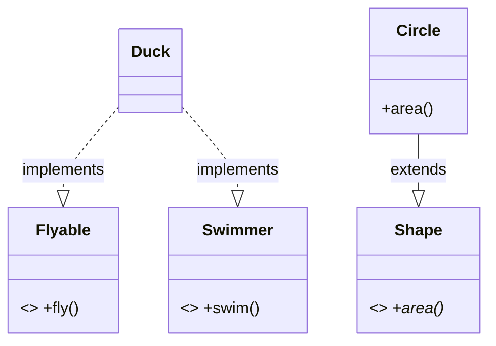

# 接口与抽象类

写过 TypeScript 的 `interface`？Java 的接口你会秒懂。但 Java 8 给接口加了**默认方法**，能力更强。

## 接口 interface

```java
interface Flyable {
    void fly();           // 默认就是 public abstract，可省略
}

interface Swimmer {
    default void swim() {     // JDK 8：接口可以有默认实现
        System.out.println("游泳中...");
    }
}

class Duck implements Flyable, Swimmer {   // 实现多个接口
    @Override
    public void fly() { }
}
```

**关键**：Java 类只能 `extends` 一个父类（单继承），但可以 `implements` 多个接口——这就是 Java 的"多继承"替代方案。这也是 Spring 里大量用接口的原因。

## 接口 vs 抽象类

| | 接口 interface | 抽象类 abstract class |
|---|---|---|
| 能 new 吗 | 不能 | 不能 |
| 字段 | 只能是常量 | 普通字段 |
| 方法 | 抽象 + default（JDK8） | 抽象 + 具体方法 |
| 继承 | 可实现多个 | 只能继承一个 |
| 对标前端 | TS 的 interface | 抽象程度更高的父类 |

## 什么时候用哪个

- **用接口**：定义"能力/契约"。比如 `Comparable`（可比较）、`Runnable`（可运行）。Spring 服务层通常定义 `UserService` 接口 + `UserServiceImpl` 实现。
- **用抽象类**：多个子类有**共享的字段和具体方法**，只是个别行为不同。比如 `AbstractController`。



## 完整可运行示例

```java
--8<-- "language/ch09-interface-abstract/src/main/java/com/javaglm/language/ch09/InterfaceDemo.java"
```

---

[:octicons-arrow-left-16: 上一章：封装·继承·多态](08-encap-inherit-poly.md) ｜ 下一章：包与访问修饰符
