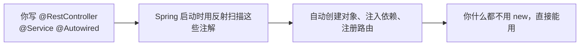

# 注解与反射基础

这一章是**读懂 Spring 的钥匙**。Spring 里到处是 `@`：`@RestController`、`@Service`、`@Autowired`、`@RequestMapping`……它们怎么起作用的？答案就是**注解 + 反射**。

## 注解 = 代码的"标签"

```java
@Override           // 内置：标记重写
@Deprecated         // 内置：标记过时
@Table(name="t_user")   // 自定义：标记这个类对应哪张表
class User { }
```

**注解本身什么都不做**，它只是个标签。真正干活的是"读这个标签的程序"。比如：

- 编译器读 `@Override` 帮你检查重写对不对；
- Spring 读 `@RestController` 知道"这个类要当成接口处理器注册"；
- MyBatis-Plus 读 `@Table` 知道"这个类对应哪张表"。

## 自定义注解

```java
@Retention(RetentionPolicy.RUNTIME)   // 关键：运行时保留，反射才能读到
@Target(ElementType.TYPE)             // 只能贴在类上
@interface Table {
    String name();                    // 注解属性
}
```

!!! info "@Retention 决定注解活多久"
    - `SOURCE`：只存在于源码，编译后丢弃（如 `@Override`）。
    - `CLASS`：保留到 class 文件，但运行时读不到（默认）。
    - **`RUNTIME`**：运行时可通过反射读到。**Spring 的注解基本都是这个。**

## 反射：运行时窥探类

```java
Class<?> clazz = User.class;
clazz.getSimpleName();              // 类名
clazz.getDeclaredFields();          // 所有字段
clazz.getAnnotation(Table.class);   // 读取注解
clazz.isAnnotationPresent(Table.class);  // 是否有这个注解
```

## Spring 的核心套路（剧透）



**你贴注解 → Spring 用反射读注解 → 自动帮你干活。** 这就是"控制反转 / 依赖注入"（第 20 章），也是注解和反射存在的最大意义。

## 完整可运行示例

```java
--8<-- "language/ch18-annotation-reflection/src/main/java/com/javaglm/language/ch18/AnnotationReflectionDemo.java"
```

---

[:octicons-arrow-left-16: 上一章：IO 与文件基础](17-io.md) ｜ 下一章：多线程入门
