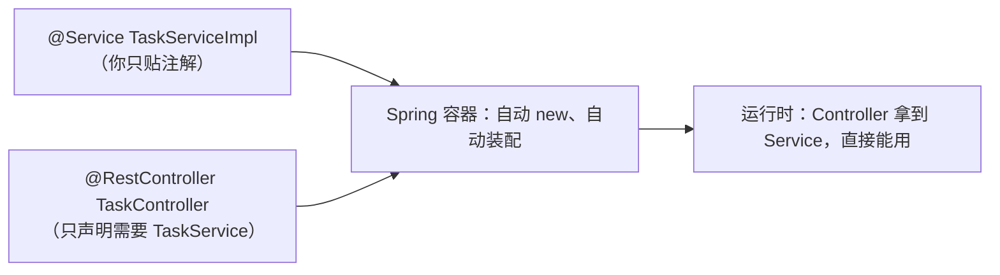

# IoC 与 DI：Spring 的灵魂

这是读懂 Spring 的**第一把钥匙**。两个词：**IoC**（控制反转）和 **DI**（依赖注入）。

## 没有 Spring 的世界（手动 new）

假设 `TaskController` 要用 `TaskService`，传统写法是自己 `new`：

```java
class TaskController {
    private TaskService taskService = new TaskServiceImpl();   // 自己创建依赖
}
```

问题：Controller 和具体实现 `TaskServiceImpl` **死死绑死**了。想换成别的实现？想写单元测试替换成假的？都很难。

## Spring 的做法：别自己 new，让容器给你

```java
@RestController
public class TaskController {
    private final TaskService taskService;

    public TaskController(TaskService taskService) {   // 构造器声明"我需要 TaskService"
        this.taskService = taskService;
    }
}
```

Controller **只声明**"我需要 `TaskService`"，**不关心**它怎么来。Spring 启动时发现 `@RestController`、`@Service` 这些注解（第 18 章讲的反射），自动：

1. 创建 `TaskServiceImpl` 实例（因为标了 `@Service`）；
2. 创建 `TaskController` 实例（因为标了 `@RestController`）；
3. 把 `TaskServiceImpl` **塞进** `TaskController` 的构造器。



**控制反转**：对象的创建/管理"控制权"从你的代码**反转**给了 Spring 容器。
**依赖注入**：容器把依赖**注入**到需要它的对象里。

## 对标前端

- 你写 Vue 组件时 `props` 从父组件**传进来**，组件自己不 new 数据——这就是"注入"的思想。
- Spring 把这种"谁来提供依赖"的工作，交给了一个统一的**容器**，全局自动管理。

## 三种注入方式

```java
// 1. 构造器注入（推荐，本书统一用这个）
public TaskController(TaskService taskService) { ... }

// 2. 字段注入（@Autowired，简单但不推荐）
@Autowired private TaskService taskService;

// 3. setter 注入（少用）
```

!!! tip "为什么推荐构造器注入"
    依赖一目了然（看构造器参数就知道这玩意需要啥）、字段能 `final`（不可变更安全）、方便单元测试（直接 new 传参）。IDEA 也会提示你用构造器注入。

## 实际代码

下面是任务接口 Controller，它的 `TaskService` 就是通过构造器注入的——它自己没有 `new`：

```java
--8<-- "task-manager/src/main/java/com/javaglm/task/controller/TaskController.java"
```

认证接口同理：

```java
--8<-- "task-manager/src/main/java/com/javaglm/task/controller/AuthController.java"
```

---

[:octicons-arrow-left-16: 上一章：多线程入门](../02-language/19-concurrency.md) ｜ 下一章：第一个 Spring Boot 项目
