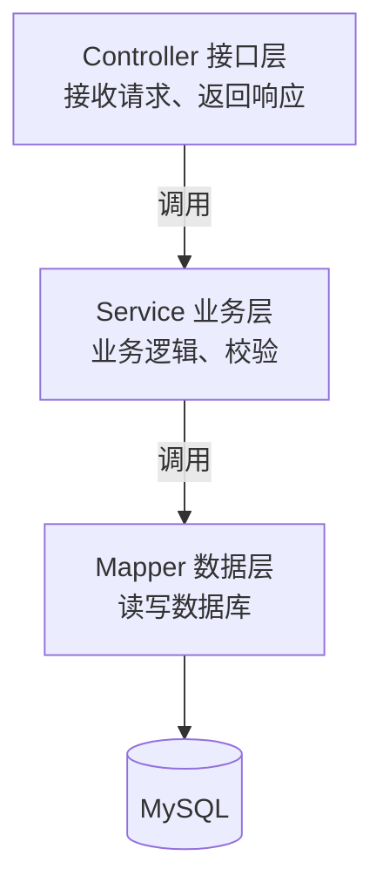

# REST 与分层架构

后端代码不该一坨塞在 Controller 里。Spring 项目的标准姿势是**分层**：Controller → Service → Mapper。

## 三层架构



| 层 | 职责 | 对标前端 |
|---|---|---|
| **Controller** | 接 HTTP 请求、参数校验、调 Service、包装返回 | API 路由处理函数 |
| **Service** | 核心业务逻辑（算钱、校验、组合数据） | composable / 业务函数 |
| **Mapper** | 读写数据库 | 调用数据 API 获取数据 |

**原则**：Controller 保持"瘦"（只做转发），业务逻辑放 Service，数据访问放 Mapper。这样每层职责单一、好测试、好维护。

## 一次请求的完整流转

以 `POST /tasks` 创建任务为例：

```
HTTP 请求 → JwtInterceptor(校验token) → TaskController.create()
         → TaskService.createTask()   (业务：组装数据)
         → TaskServiceImpl.save()     (MyBatis-Plus 自动 insert)
         → MySQL
         → 返回 Result<Task> → 转 JSON → HTTP 响应
```

## 实际代码（四层全貌）

**Controller 层**——接请求、调 Service：

```java
--8<-- "task-manager/src/main/java/com/javaglm/task/controller/TaskController.java"
```

**Service 接口**——定义业务契约：

```java
--8<-- "task-manager/src/main/java/com/javaglm/task/service/TaskService.java"
```

**Service 实现**——真正的业务逻辑：

```java
--8<-- "task-manager/src/main/java/com/javaglm/task/service/impl/TaskServiceImpl.java"
```

**Mapper**——数据访问（继承 BaseMapper，自动有 CRUD）：

```java
--8<-- "task-manager/src/main/java/com/javaglm/task/mapper/TaskMapper.java"
```

## 关键注解速记

| 注解 | 作用 |
|---|---|
| `@RestController` | 标记 Controller，返回值转 JSON |
| `@RequestMapping("/tasks")` | 类级别路径前缀 |
| `@GetMapping` / `@PostMapping` / `@PutMapping` / `@DeleteMapping` | 对应 HTTP 方法 |
| `@Service` | 标记 Service 实现类，被 Spring 管理 |
| `@Autowired`（或构造器） | 注入依赖 |

!!! tip "为什么 Service 要拆接口 + 实现"
    接口 `TaskService` 定义"做什么"，实现 `TaskServiceImpl` 定义"怎么做"。Controller 依赖接口（第 09 章的面向接口编程），以后换实现、写测试 mock，都不用动 Controller。这是工程规范，不是必须，但推荐。

---

[:octicons-arrow-left-16: 上一章：第一个 Spring Boot 项目](21-first-project.md) ｜ 下一章：参数接收与校验
