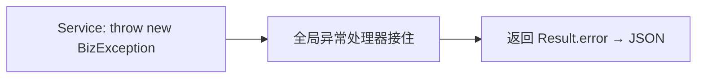

# 统一响应与全局异常处理

让所有接口返回**统一格式**，让所有异常**集中处理**——这是后端工程化的基本功。

## 统一响应：Result

前端最怕接口返回格式不统一（这个返回 `{data}`，那个返回 `{result}`）。约定一个统一结构：

```json
{ "code": 200, "message": "success", "data": {...} }
```

用 `Result<T>` 包装，Controller 返回 `Result.success(data)` 即可：

```java
--8<-- "task-manager/src/main/java/com/javaglm/task/common/Result.java"
```

前端 axios 封装里就能统一判断 `res.data.code === 200`，逻辑极其清爽。

## 业务异常：BizException

业务出错（余额不足、任务不存在）不该用返回码 if/else 判断，而是**直接抛异常**：

```java
--8<-- "task-manager/src/main/java/com/javaglm/task/common/BizException.java"
```

```java
// Service 里直接抛，不用层层 return 错误码
if (task == null) {
    throw new BizException(404, "任务不存在");
}
```

## 全局异常处理器：@RestControllerAdvice

抛出的异常谁来接？**全局异常处理器**，集中转成 `Result`：

```java
--8<-- "task-manager/src/main/java/com/javaglm/task/config/GlobalExceptionHandler.java"
```

`@RestControllerAdvice` 让这个类**全局拦截**所有 Controller 抛出的异常。每种异常写一个 `@ExceptionHandler` 方法：

- `BizException` → 返回业务码 + 消息；
- `MethodArgumentNotValidException`（参数校验失败）→ 返回 400 + 校验消息；
- `Exception`（兜底）→ 返回 500。

!!! warning "兜底异常要脱敏"
    `Exception` 兜底分支只返回固定的"服务器内部错误"，**不把 `e.getMessage()` 返回给前端**。因为未预期异常可能含 SQL 语句、文件路径、类名等内部信息，泄漏出去是安全隐患。真正细节用日志 `log.error("未预期异常", e)` 记录下来供排查。而 `BizException` 的 message 是我们自己写的、安全的，可以放心返回前端。

## 整体效果

Service 里随便抛 `BizException`，Controller 不用 try/catch，前端永远收到统一的 `{code, message, data}`。例如 TaskServiceImpl 修改任务时校验归属：

```java
--8<-- "task-manager/src/main/java/com/javaglm/task/service/impl/TaskServiceImpl.java"
```

看 `updateTask` / `deleteTask`：归属不对直接 `throw new BizException(404, ...)`，由全局处理器转成友好响应。



---

[:octicons-arrow-left-16: 上一章：参数接收与校验](23-params-validation.md) ｜ 下一章：配置管理
