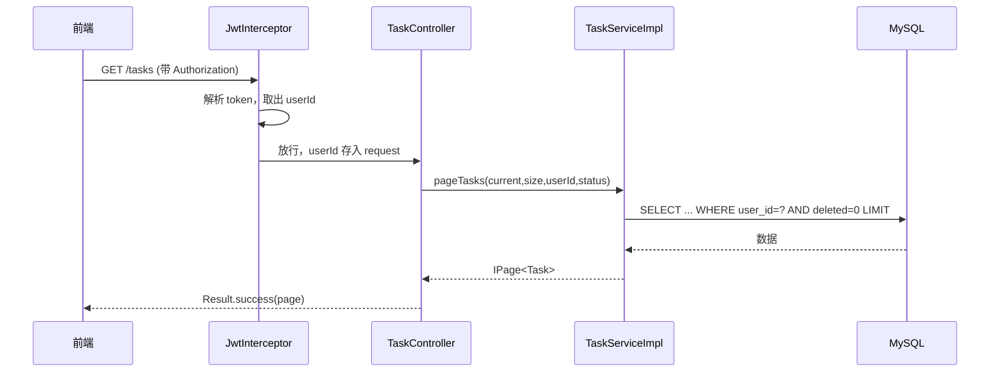

# 任务 CRUD 业务实现

把前面学的分层、校验、统一响应、MyBatis-Plus 串起来，实现任务的增删改查。

## 接口一览

| 方法 | 路径 | 作用 |
|---|---|---|
| GET | `/tasks?current=1&size=10&status=0` | 分页查询当前用户的任务 |
| POST | `/tasks` | 新建任务 |
| PUT | `/tasks/{id}` | 修改任务 |
| DELETE | `/tasks/{id}` | 删除任务（逻辑删除） |

## 业务实现

完整的 Service 实现——注意每个方法里的**归属校验**：

```java
--8<-- "task-manager/src/main/java/com/javaglm/task/service/impl/TaskServiceImpl.java"
```

关键点：

- **pageTasks**：用 `LambdaQueryWrapper` 拼 `user_id = ?`（只查自己的）、可选 `status`、按创建时间倒序，调 `this.page(...)` 分页。
- **createTask**：组装 Task 对象（userId 来自 JWT，不是前端传的），`this.save(task)` 插入。
- **updateTask**：先 `getById` 查出来，**校验 `userId` 归属**（防越权改别人任务），再更新。
- **deleteTask**：同样校验归属，`this.removeById` 逻辑删除。

## Controller

接参数、调 Service、包 Result：

```java
--8<-- "task-manager/src/main/java/com/javaglm/task/controller/TaskController.java"
```

注意 `userId` 的来源：

```java
Long userId = (Long) request.getAttribute("userId");
```

它**不是前端传的**，而是 JWT 拦截器（第 29 章）解析 token 后放进请求上下文的。这样**绝对防伪造**——前端没法假装自己是别人。

## 完整调用链



## 用 Postman 测试

1. 先调 `POST /auth/login` 拿到 token；
2. 后续请求 Header 加 `Authorization: Bearer <token>`；
3. `POST /tasks`，body：`{"title":"学Java","status":0}`；
4. `GET /tasks` 看列表。

---

[:octicons-arrow-left-16: 上一章：数据库设计实战](27-database-design.md) ｜ 下一章：JWT 认证
