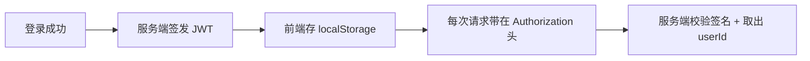

# JWT 认证

实现注册 / 登录，以及登录后请求的 token 校验。这是前端人最熟悉的后端话题——你天天在 Vue 里存 token、塞 header、做拦截器，这章讲后端那半。

## JWT 是什么

JWT（JSON Web Token）是一段签名过的字符串，**服务端签发、客户端保存、每次请求带上**。服务端靠它认人，不用在服务器存 session。



对标前端：就是你 axios 请求拦截器里 `config.headers.Authorization = 'Bearer ' + token` 那套，这里讲后端怎么签发和校验。

## 注册 / 登录：AuthService

注册：用户名查重 + **BCrypt 哈希**存密码（绝不存明文）。登录：校验密码 + 签发 token。

```java
--8<-- "task-manager/src/main/java/com/javaglm/task/service/impl/AuthServiceImpl.java"
```

!!! info "为什么用 BCrypt"
    明文存密码是灾难。BCrypt 是专门为密码设计的哈希：每次哈希结果不同（带随机盐）、故意很慢（防暴力破解）、不可逆。`encode` 哈希、`matches` 校验。这里只引了 `spring-security-crypto`（轻量），没引完整 Spring Security（避免它自动锁死所有接口）。

## 签发与解析：JwtUtil

```java
--8<-- "task-manager/src/main/java/com/javaglm/task/security/JwtUtil.java"
```

- `generateToken`：把 `userId` 放进 subject，设过期时间，用密钥 HS256 签名。
- `parseToken`：解析验证，签名错/过期会抛异常。

## 拦截校验：JwtInterceptor

每个需要登录的请求，进 Controller 前先校验 token、取出 userId：

```java
--8<-- "task-manager/src/main/java/com/javaglm/task/security/JwtInterceptor.java"
```

对标前端的**路由守卫**：进页面前先检查有没有 token，没有就跳登录。这里是后端版本——没 token 直接 401。

!!! tip "为什么第一行先放行 OPTIONS"
    跨域时浏览器会先发一个 `OPTIONS` 预检请求"试探"，它**不带 `Authorization`**。如果不放行，预检会被这里 401 拦死，浏览器收不到 CORS 响应头，跨域直接失败（见下一章 CORS）。所以拦截器开头先判断：是预检就放行，再校验真正的业务请求。

## 注册拦截器 + 放行登录

```java
--8<-- "task-manager/src/main/java/com/javaglm/task/config/WebMvcConfig.java"
```

`excludePathPatterns("/auth/**", "/health", "/error")`：登录、注册、健康检查不用 token（否则还没登录就被拦住了）。

## 认证接口

```java
--8<-- "task-manager/src/main/java/com/javaglm/task/controller/AuthController.java"
```

## 完整流程串联

1. 用户调 `POST /auth/register` → 注册成功；
2. 调 `POST /auth/login` → 返回 `{ token, user }`；
3. 前端把 token 存起来；
4. 之后每个请求带 `Authorization: Bearer <token>`；
5. `JwtInterceptor` 校验、取出 userId 存入 request；
6. Controller 用 `request.getAttribute("userId")` 拿到当前用户，查"我的任务"。

第四篇会用 Vue 把这套前端对接做出来。

---

[:octicons-arrow-left-16: 上一章：任务 CRUD 业务实现](28-task-crud.md) ｜ 下一章：跨域 CORS
