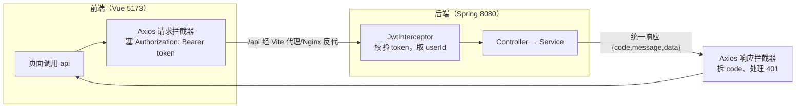
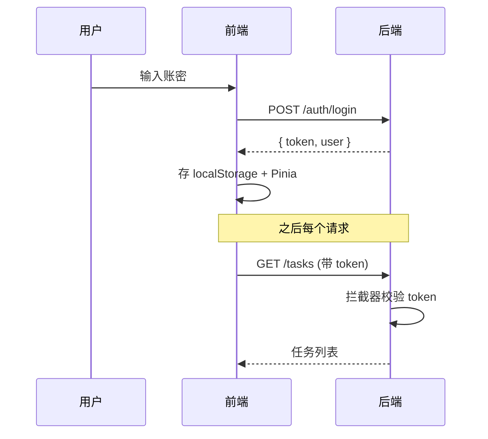

# 前后端联调总览

后端你已经会写了，这一章把 Vue 前端接上去。核心是 **Axios + 拦截器**——这是你前端天天写的东西，只不过现在后端也是你自己写的。

## 联调全景



## Axios 封装（核心）

一个 axios 实例 + 两个拦截器，搞定所有对接细节：

```typescript
--8<-- "fullstack-frontend/src/api/request.ts"
```

两件事：

1. **请求拦截器**：每个请求自动带上 `Authorization: Bearer <token>`（token 从 Pinia store 拿）。
2. **响应拦截器**：统一拆后端的 `{code, message, data}`，`code===200` 就把 `data` 直接返回；遇到**业务码** 401（token 失效）自动登出跳转。

!!! tip "为什么 401 要在响应拦截器里判断，而不是 axios 的错误回调？"
    后端全局异常处理器把所有异常（包括 401 鉴权失败）都返回 **HTTP 200**，真正的状态码放在 body 的 `code` 字段里。所以"token 失效"是 `HTTP 200 + body.code===401`，会走进**成功回调**——必须在成功回调里按 `code` 判断，axios 的错误回调（HTTP 非 2xx）根本不会触发。

这样业务代码只管调接口、拿数据，**完全不用碰 token 和错误处理**。

## 接口定义

```typescript
--8<-- "fullstack-frontend/src/api/auth.ts"
```

```typescript
--8<-- "fullstack-frontend/src/api/task.ts"
```

## 开发期跨域：Vite 代理

前端 5173 调后端 8080 是跨域。开发期最省事的是用 Vite 代理（不用动后端 CORS）：

```typescript
--8<-- "fullstack-frontend/vite.config.ts"
```

`/api/*` 被转发到 `localhost:8080` 并去掉 `/api` 前缀。所以前端 `request.get('/tasks')` 实际打到后端 `http://localhost:8080/tasks`。

## token 的完整生命周期



---

[:octicons-arrow-left-16: 上一章：接口测试](../03-spring/31-testing.md) ｜ 下一章：Vue 3 实现前端
