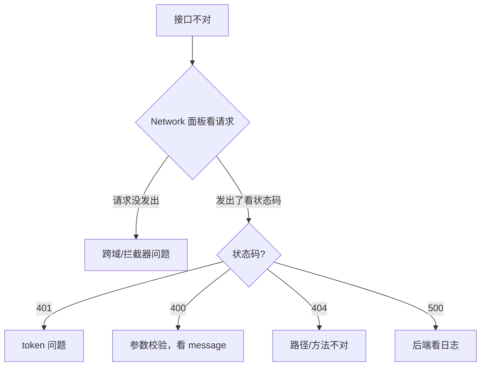

# 联调常见坑

前后端联调时的高频踩坑点，提前知道能省大量排查时间。

## 1. 跨域（CORS）

**现象**：浏览器控制台报 `Access-Control-Allow-Origin`，请求发不出去。

**原因**：前端 5173 → 后端 8080 端口不同。

**解决**（二选一）：

- 开发期：Vite 代理（第 32 章 `vite.config.ts`）——推荐，不动后端。
- 通用：后端配 CORS（第 30 章 `CorsConfig`）——生产环境必须有。

!!! warning "OPTIONS 预检请求被拦"
    带 `Authorization` 头的请求会先发 `OPTIONS` 预检。如果后端的 JWT 拦截器把 `OPTIONS` 也拦了（要求 token），预检就失败。本书 `CorsConfig` 让 Spring 自动处理 OPTIONS，没问题；如果你用 Spring Security 要单独放行 OPTIONS。

## 2. token 过期 / 失效

**现象**：登录成功，过几小时突然所有请求 401。

**原因**：JWT 有过期时间（本书默认 24 小时）。

**解决**：

- 前端响应拦截器捕获 401 → 清登录态跳登录（第 32 章已实现）。
- 进阶：**双 token（access + refresh）**，access 短期、refresh 长期，access 过期用 refresh 换新的。本书没实现，生产环境推荐。

## 3. 字段命名：驼峰 vs 下划线

**现象**：后端返回 `create_time`，前端拿 `createTime` 拿不到（undefined）。

**原因**：数据库列是下划线，Java 实体是驼峰，JSON 序列化默认用 Java 字段名（驼峰）。

**本书的处理**：`application.yml` 配了 `map-underscore-to-camel-case: true`，Java 实体用驼峰 `createTime`，返回给前端的 JSON 就是 `createTime`。前端统一用驼峰，对齐。

**如果对不齐**：后端用 `@JsonProperty("create_time")` 指定 JSON 字段名，或前端手动转换。

## 4. 日期时区

**现象**：后端存的时间，前端显示差了 8 小时。

**原因**：时区不一致。

**解决**：

- 数据库连接串加 `serverTimezone=Asia/Shanghai`（本书已加）。
- 前端展示用 `dayjs` 等库统一格式化。

## 5. 数据结构对不上

**现象**：前端 `res.records` 是 undefined。

**原因**：后端分页返回 `{records, total, ...}`（MyBatis-Plus 的 `IPage`），但你以为返回的是数组。

**解决**：对齐后端返回结构。本书后端用 `IPage`，前端就取 `.records`（第 33 章）。

## 6. 400 参数校验失败

**现象**：POST 报 400，`message: "标题不能为空"`。

**原因**：后端 `@Valid` 校验拦下了。

**解决**：前端把必填字段填上。后端返回的 `message` 直接展示给用户（全局异常处理器已格式化）。

## 排查三板斧

---

[:octicons-arrow-left-16: 上一章：Vue 3 实现前端](33-vue-frontend.md) ｜ 下一章：部署上线
