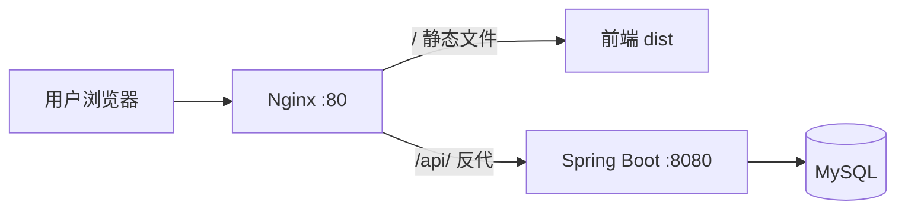

# 部署上线

把前后端部署到服务器，让真实用户能访问。

## 总体方案



Nginx 同一端口托管前端静态文件 + 反代后端 API，**前后端同源，彻底无跨域**（生产环境不用 CORS）。

## 第一步：后端打包

Spring Boot 用 `spring-boot-maven-plugin` 打成可执行 jar：

```bash
cd code/task-manager
mvn clean package -DskipTests
# 产物：target/task-manager-1.0.0-SNAPSHOT.jar
```

部署到服务器后运行：

```bash
java -jar task-manager-1.0.0-SNAPSHOT.jar --spring.profiles.active=prod
```

!!! tip "后台常驻运行"
    生产环境用 `nohup`、`systemd` 或 `supervisor` 让进程常驻、开机自启、崩溃重启。别直接 `java -jar` 挂着，终端关了进程就没了。

## 第二步：前端打包

```bash
cd code/fullstack-frontend
npm run build
# 产物：dist/ 目录
```

把 `dist/` 整个目录上传到服务器（如 `/usr/share/nginx/html`）。

## 第三步：Nginx 配置

```
--8<-- "fullstack-frontend/deploy/nginx.conf"
```

**关键**：

- `location /`：托管前端，`try_files` 让 SPA 历史路由刷新不 404。
- `location /api/`：反代后端，`proxy_pass` 末尾的 `/` 会去掉 `/api` 前缀（前端 `/api/tasks` → 后端 `/tasks`）。

```bash
# 重载配置
nginx -s reload
```

## 第四步：MySQL 部署

服务器装 MySQL，跑建表 SQL（第 27 章），配好后端的 `application-prod.yml` 数据源指向它。

## 第五步：验证

1. 浏览器访问 `http://你的域名` → 看到登录页；
2. 注册登录 → 能加任务；
3. F12 Network 看 `/api/*` 请求 200，无跨域报错。

## 常见部署问题

| 现象 | 原因 / 解决 |
|---|---|
| 页面空白 | dist 没放对地方 / `try_files` 没配 |
| 刷新 404 | Nginx 没配 SPA 回退（`try_files ... /index.html`） |
| 接口 502 | 后端 jar 没起 / 端口不对 |
| 接口跨域 | 没走 Nginx 反代，直连了后端端口 |

## 进阶

- **HTTPS**：用 Let's Encrypt + certbot 给 Nginx 加免费证书。
- **容器化**：Docker 打包前后端 + docker-compose 一键起。
- **CI/CD**：push 自动构建部署（本书是本地构建，未涉及）。

恭喜——到这里，你已经能独立写一个前后端分离的全栈项目并部署上线了 🎉。

---

[:octicons-arrow-left-16: 上一章：联调常见坑](34-common-pitfalls.md) ｜ [第五篇 · 进阶与新特性](../05-advanced/36-jdk8-to-17.md)
