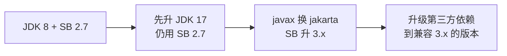

# 从 Spring Boot 2.7 到 3.x

Spring Boot 3.0（2022 年底）是个**大版本**，引入了破坏性变更。即使你公司还在 2.7，也要知道 3.x 变了什么——新项目、开源组件、面试都会涉及。

## 三个核心变化

### 1. 基线升到 Java 17

Spring Boot 3.x **最低要求 Java 17**，不再支持 Java 8。所以你升 3.x 必须先升 JDK。

### 2. javax → jakarta（最大改动）

Java EE 的包名从 `javax.*` 全部改成了 `jakarta.*`（因为 Oracle 把商标捐给了 Eclipse 基金会）。**所有 import 要改**：

```java
// Spring Boot 2.7（javax）
import javax.servlet.http.HttpServletRequest;
import javax.validation.constraints.NotBlank;
import javax.persistence.Entity;

// Spring Boot 3.x（jakarta）
import jakarta.servlet.http.HttpServletRequest;
import jakarta.validation.constraints.NotBlank;
import jakarta.persistence.Entity;
```

本书的 task-manager 用的是 2.7（`javax.*`）。如果升 3.x，这些 import 全要批量替换。

### 3. 用 GraalVM 原生镜像（可选）

3.x 支持把应用编译成原生镜像，启动极快、内存极省（代价是构建慢、反射要配置）。云原生场景有用，一般项目暂不必管。

## 升级影响（本书代码为例）

| 本书代码 | 2.7（现状） | 升到 3.x |
|---|---|---|
| pom parent | `spring-boot-starter-parent:2.7.18` | `3.2.x` |
| `<java.version>` | `1.8` | `17` |
| servlet import | `javax.servlet.*` | `jakarta.servlet.*` |
| validation import | `javax.validation.*` | `jakarta.validation.*` |
| MyBatis-Plus | `3.5.3.1`（javax） | 需 `3.5.4+`（jakarta 版） |

## 迁移建议



分两步走更稳：先在 2.7 里把 JDK 升到 17（2.7 支持 17），跑通了再换 jakarta + 升 3.x。一次升太多容易炸。

## 要不要升

- **新项目**：直接上 Spring Boot 3.x + JDK 17/21，拥抱未来。
- **老项目**：看公司情况，2.7 还能用几年，但要有升级规划。

本书选 2.7 + JDK 8，是为了贴合"国内公司现状"。学完本书你再面对 3.x，核心知识（IoC、分层、MyBatis-Plus、JWT、前后端联调）**完全通用**，只是包名和 JDK 版本不同。

---

[:octicons-arrow-left-16: 上一章：从 JDK 8 到 17](36-jdk8-to-17.md) ｜ 下一章：JVM 入门与线程池实战
