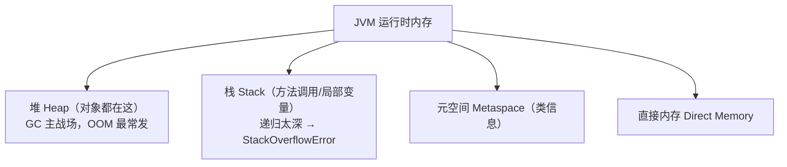

# JVM 入门与线程池实战

够用即可：看得懂内存和 GC 的报错、会用线程池、不踩坑。不深挖调优（那是 Java 工程师进阶）。

## JVM 内存区域（看懂报错用）



| 区域 | 存什么 | 撑爆会怎样 |
|---|---|---|
| **堆 Heap** | 所有 `new` 出来的对象 | `OutOfMemoryError: Java heap space` |
| **栈 Stack** | 方法调用、局部变量 | `StackOverflowError`（无限递归） |
| **元空间** | 加载的类信息 | `OOM: Metaspace`（极少） |

**实战认知**：99% 的内存问题在堆。`OOM: Java heap space` = 东西 new 太多/内存泄漏；调大堆 `-Xmx`（最大堆）能临时缓解。

## GC 垃圾回收（概念）

JVM 自动回收"没人引用的对象"（不用像 C 手动 free）。你主要知道：

- **Minor GC**：清理年轻代，频繁但快。
- **Full GC**：清理整个堆，慢，STW（Stop The World，暂停所有线程）。
- **调优目标**：尽量少 Full GC（它会让应用卡顿）。

前端人对照：JS 也有 GC（V8 的），原理相通——找没人引用的对象回收。Java 的 GC 更成熟、可调。

## 看懂常见报错

| 报错 | 含义 | 排查 |
|---|---|---|
| `OutOfMemoryError: Java heap space` | 堆内存不够 | 数据太大/内存泄漏，调 `-Xmx` |
| `StackOverflowError` | 栈溢出 | 无限递归、递归太深 |
| `OOM: unable to create new native thread` | 线程太多 | 线程池没限制、创建太多线程 |

## 线程池实战

第 19 章介绍了线程池。这里讲**怎么用对**。

### Executors 提供的现成线程池

```java
Executors.newFixedThreadPool(10);     // 固定 10 个线程
Executors.newCachedThreadPool();      // 按需创建，空闲回收
Executors.newSingleThreadExecutor();  // 单线程（任务串行）
```

!!! warning "阿里规约：别用 Executors"
    `newFixedThreadPool`/`newCachedThreadPool` 的任务队列无界或线程数无界，可能 OOM。
    生产环境**用 ThreadPoolExecutor 手动构造**，明确参数。

### 手动构造 ThreadPoolExecutor

```java
ThreadPoolExecutor pool = new ThreadPoolExecutor(
    2,                              // corePoolSize 核心线程数
    4,                              // maximumPoolSize 最大线程数
    60, TimeUnit.SECONDS,           // 空闲存活时间
    new LinkedBlockingQueue<>(100), // 任务队列（必须有界！）
    new ThreadPoolExecutor.CallerRunsPolicy()  // 拒绝策略：满了让调用方自己跑
);
pool.execute(() -> doWork());
```

7 个核心参数，记住"核心/最大线程数、有界队列、拒绝策略"。

### 怎么定线程数

- **CPU 密集**（纯计算）：核心数 + 1。
- **IO 密集**（网络/数据库，你的后端多半是这个）：核心数 × 2 或更多。

### Spring 里的异步：@Async

Spring 提供 `@Async` 注解，方法自动异步执行（底层就是线程池）：

```java
@Async
public void sendEmail(String to) {
    // 这个方法会在另一个线程执行，不阻塞主流程
}
```

需要在配置类加 `@EnableAsync`。本书没展开，知道这是"Spring 帮你管线程池"的方式即可。

---

[:octicons-arrow-left-16: 上一章：从 Spring Boot 2.7 到 3.x](37-springboot3.md) ｜ 下一章：学习路线与生态
