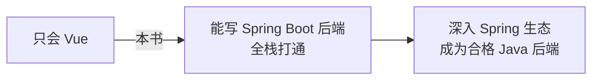

# 学习路线与 Spring 生态

恭喜走完全书！你能独立写 Spring Boot 后端、完成全栈部署了。这一章告诉你**接下来往哪走**。

## 你现在的位置

## Spring 生态地图

Spring 是个庞大的家族，本书只学了核心的 Spring Boot + Spring MVC。其他常用成员：

| 组件 | 干什么 | 什么时候学 |
|---|---|---|
| **Spring Security** | 认证授权框架（比本书手写 JWT 更全） | 做复杂权限时 |
| **Spring Data JPA** | 另一种 ORM（对标 MyBatis-Plus） | 去用 JPA 的公司前 |
| **Spring Data Redis** | 操作 Redis 缓存 | 加缓存/会话时 |
| **Spring Cloud** | 微服务全家桶（注册中心、网关、配置中心） | 做微服务架构时 |
| **Spring AMQP / Kafka** | 消息队列 | 做异步解耦时 |
| **Spring Batch** | 批处理 | 跑大批量任务时 |

**建议顺序**：先把本书内容练熟（做个完整项目），然后学 **Redis**（缓存，几乎必用）→ **Spring Security**（权限）→ 再看业务需要选学微服务。

## 深入方向（按兴趣/岗位选）

1. **数据库与 SQL**：复杂查询、索引优化、事务隔离级别。MyBatis-Plus 只解决 CRUD，复杂 SQL 还得手写。
2. **并发**：本书只入门。深入学 JUC（`CountDownLatch`、`CompletableFuture`、`ConcurrentHashMap`）。
3. **JVM**：内存模型、GC 调优、性能排查工具（`jstack`、`jmap`、Arthas）。
4. **设计模式**：Spring 源码里全是模式（工厂、代理、模板方法、观察者）。读懂 Spring 源码能力大涨。
5. **微服务**：Spring Cloud Alibaba（Nacos、Sentinel、Seata）——国内主流。

## 推荐资源

| 资源 | 用途 |
|---|---|
| [Spring 官方文档](https://docs.spring.io/spring-boot/) | 最权威，英文，能读尽量读 |
| [MyBatis-Plus 官网](https://baomidou.com/) | 中文，查 API |
| 《深入理解 Java 虚拟机》（周志明） | JVM 圣经 |
| 《Effective Java》 | 写好 Java 的最佳实践 |
| Maven 仓库 [mvnrepository.com](https://mvnrepository.com/) | 查依赖版本 |

## 给前端转后端的几句话

- **类型系统是你的朋友**：别嫌 Java 啰嗦，编译期抓 bug 省的运行时排查时间，远超多写的代码量。
- **善用 IDEA**：它的重构、跳转、调试比 VS Code 写 Java 强太多，工具红利吃满。
- **看异常堆栈**：后端报错会打印一长串 stack trace，学会顺着它定位到自己的代码行——这是后端基本功。
- **多读开源代码**：找个感兴趣的 Spring Boot 项目读，看别人怎么分层、怎么设计。

## 复盘：你掌握了什么

- Java 语言基础（OOP、集合、泛型、Stream、异常、注解反射、并发入门）
- Spring Boot 后端开发（IoC、分层、REST、校验、统一响应、MyBatis-Plus、JWT、CORS、测试）
- 全栈联调与部署（Axios、拦截器、Nginx）
- 现代 Java 认知（JDK 17、Spring Boot 3.x）

你已经是一个**能独立交付全栈功能**的开发者了。下一步，去用这些知识做一个**你自己的真实项目**——实践是最好的老师。🚀

---

[:octicons-arrow-left-16: 上一章：JVM 入门与线程池](38-jvm-threadpool.md) ｜ [:octicons-home-16: 返回首页](../index.md)
